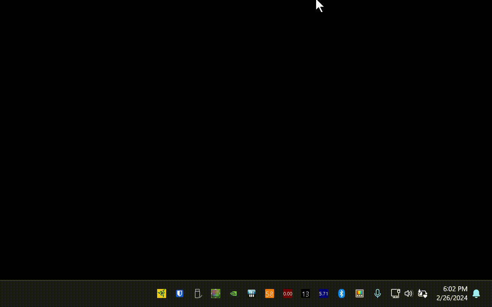

# Razer Blade control utility

For those of you who
* own a Razer Blade 16 2023 or Razor Blade 14 2023
* use Windows 11
* Razer Synapse 3 (including the Beta) makes your eyes bleed
* baffled by why your fans are always at full-throttle
* and the battery depletes in just an hour

I have great news. I've reverse-engineered the Razer protocol and have crafted an alternative solution. A drop-in predictable and compact Razer Synapse alternative.

## What can it control?

* Performance modes (including overclock)
* Lid logo modes: off, static, breathing
* Keyboard brightness (works on Windows with Fn keys anyway)

## Reverse Engineering

Read about the reverse engineering process for Razer Blade 16 in [data/README.md](data/README.md). You can follow the steps and adjust the utility for other Razer laptops.

Run `razer-cli enumerate` to get PID.
Then `razer-cli -p 0xPID info` to check if the application works for your Razer device.

Special thanks to
* [openrazer](https://github.com/openrazer) for [Reverse-Engineering-USB-Protocol](https://github.com/openrazer/openrazer/wiki/Reverse-Engineering-USB-Protocol)
* [Razer-Linux](https://github.com/Razer-Linux/razer-laptop-control-no-dkms) for USB HID protocol implementation

## FAQ

**Q**: *How to build?*

**A**: I build in WSL2(Arch) with `cargo run --release --target x86_64-pc-windows-gnu --bin razer-tray`.

**Q**: *Does it work on Linux?*

**A**: I didn't test, but nothing prevents it, all libraries are cross-platform.

**Q**: *Why Windows Defender tells me it is a Trojan*

**A**: Read https://github.com/rust-lang/rust/issues/88297, and make sure recent Intelligence Updates are installed for Microsoft Defender.

**Q**: *What's the easiest way to try?*

**A**: Download `razer-tray.exe` from [Releases](https://github.com/tdakhran/razer-ctl/releases) and launch it.
